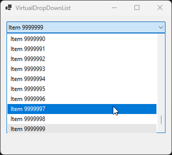

# VirtualDropDownList



## Overview

**VirtualDropDownList** is a high-performance UI control library designed to handle massive datasets with ease. In standard dropdown controls, rendering thousands of items can lead to significant memory overhead and UI lagging. This library utilizes **UI Virtualization** to solve that problem.

### Purpose
The primary goal of this library is to provide a seamless user experience by only rendering the elements currently visible in the viewport. Whether you are displaying 100 items or 1,000,000, the memory footprint remains constant and the scrolling stays buttery smooth.

---

## Key Features

* **High Performance:** Efficiently manages large-scale lists using element recycling.
* **Low Memory Footprint:** Only creates UI objects for the visible area, regardless of total list size.
* **Custom Templates:** Easily bind and style your data items to match your application's UI.
* **Instant Search:** Optimized logic for filtering through large collections without freezing the main thread.
* **Keyboard Navigation:** Full support for arrow keys, Enter, and "type-to-select" functionality.

---

## Installation

Clone and build the assembly.
TODO: provide a nuget package.

##Usage Example

```cs
public partial class MainForm : Form
{
    private Dictionary<int, string> _data = new();

    public MainForm()
    {
        InitializeComponent();
    }

    private async void MainForm_Load(object sender, EventArgs e)
    {
        // Simulate asynchronously obtaining data and storing it into memory.
        await Task.Run(() =>
        {
          for (var i = 0; i < 10_000_000; i++)
          {
              _data.Add(i, $"Item {i}");
          }
        });

        // Assign the collection size to the
        virtualDropDownList1.ItemCount = _data.Count;
        virtualDropDownList1.RetrieveItem += VirtualDropDownList1_RetrieveItem;
    }

    private void VirtualDropDownList1_RetrieveItem(object? sender, RetrieveVirtualItemEventArgs e)
    {
        // This method is invoked when the virtual renderer requests items to draw.
        // Provide the data to it so it knows what text to draw for a given item index.
        e.Item = new ListViewItem(_data[e.ItemIndex]);
    }
}
```
